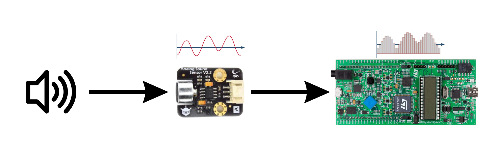

# Hands-free-Switch
This project develops a real-time sound detection system using the STM32L476 microcontroller on the Discovery Kit. An analog sound sensor monitors ambient noise, and when a defined threshold (e.g., a clap) is detected, the microcontroller activates and deactivates an onboard LED.

## Report
[Click here to view the full report](./report.pdf)

## Demo Video

A short demonstration of the sound-controlled lighting system in action.
The video shows the LED toggling in response to a snap detected by the sound sensor.

